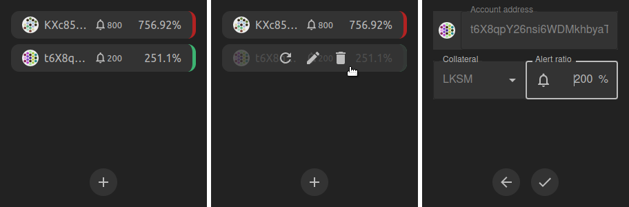
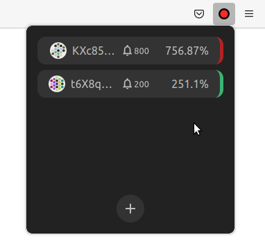

# Acalert


Acalert is a browser extension that allows to watch aUSD vaults. Watching prices go up and down is stressfull, but keeping an eye on your vaults is essential. Wouldn't it be great if you could get a notification if one of your vault passes a certain threshold? For privacy reasons though, you may not want to let a 3rd party handle this for you. Acalert was created to solve this. It will run in the background while your browser is running. A very simple interface lets you choose an address to watch a vault for and setup a threshold at which point the main extension icon will turn red to attract your attention.

Set the app and forget, until the icon turns red :)

The extension works on Firefox for now and only supports LKSM collateralized positions. Please let me know if there is interrest for more.



## How to install Acalert on Firefox

- Download the `.xpi` file in the asset section of the [latest release](https://github.com/Tbaut/Acalert/releases)
- Click on the Menu > Addons And Themes, or type in the address bar `about:addons`
- Click on the cog wheel and "Install Add-on From File"
- Select the `.xpi` file you downloaded in the first step
- You should now see the Acalert extension, you can add the accounts you want to keep an eye on.

**This extension does not require any permission, it does NOT have access to your tabs or the website you navigate.**

## Development

```bash
yarn dev
```

Then **load extension in browser with the `extension/` folder**.

For Firefox developers, you can run the following command instead:

```bash
yarn start:firefox
```

`web-ext` auto reload the extension when `extension/` files changed.

> While Vite handles HMR automatically in the most of the case, [Extensions Reloader](https://chrome.google.com/webstore/detail/fimgfedafeadlieiabdeeaodndnlbhid) is still recommanded for cleaner hard reloading.

## Build

To build the extension, run

```bash
yarn build
```

And then pack files under `extension`, you can upload `extension.crx` or `extension.xpi` to appropriate extension store.

## Credits

This repo was made based on the excellent https://github.com/quolpr/react-vite-webext